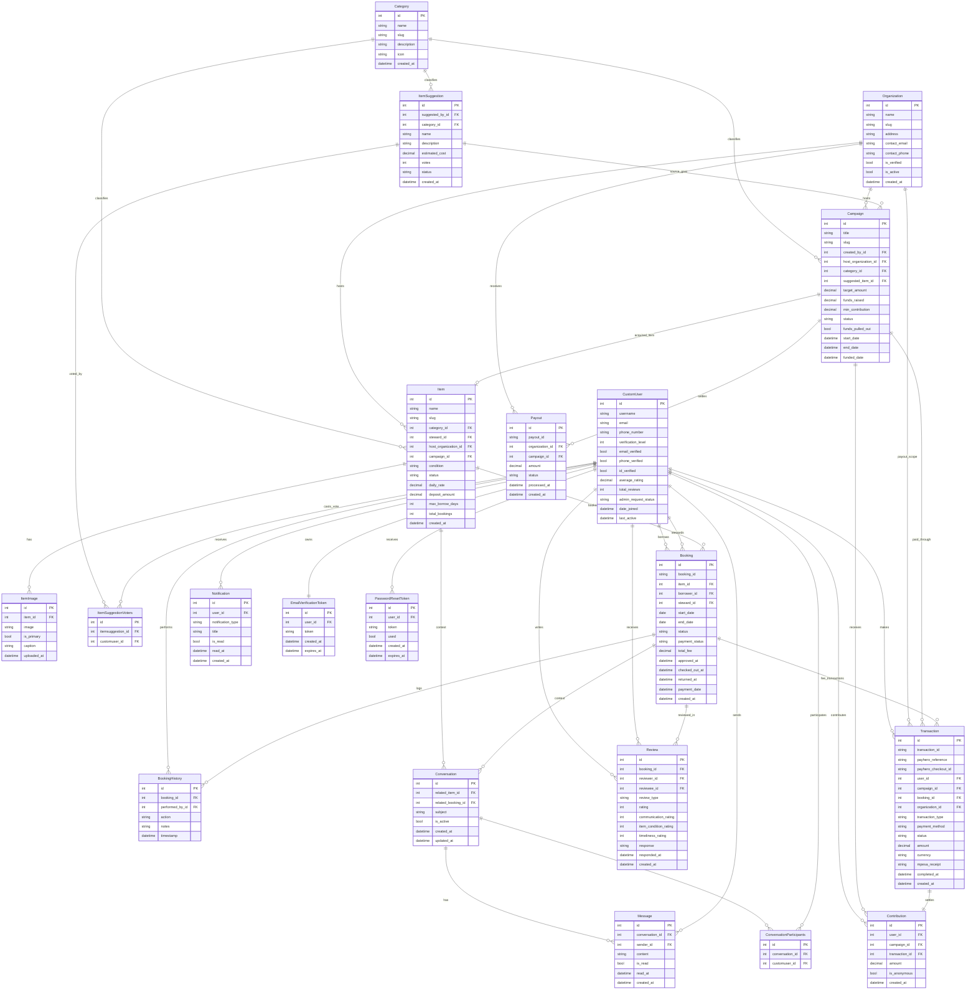
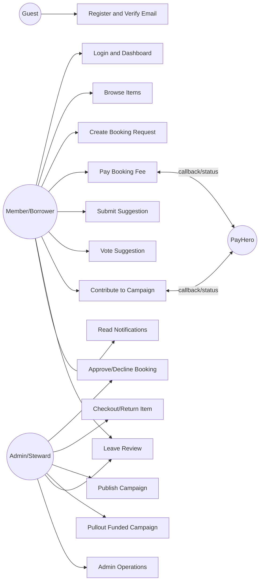
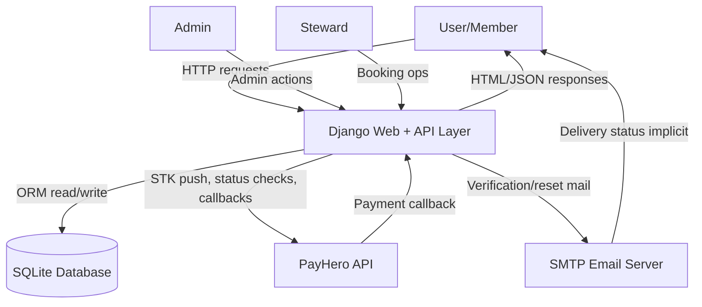
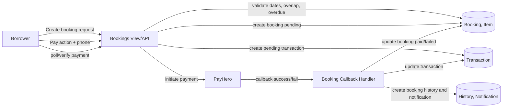
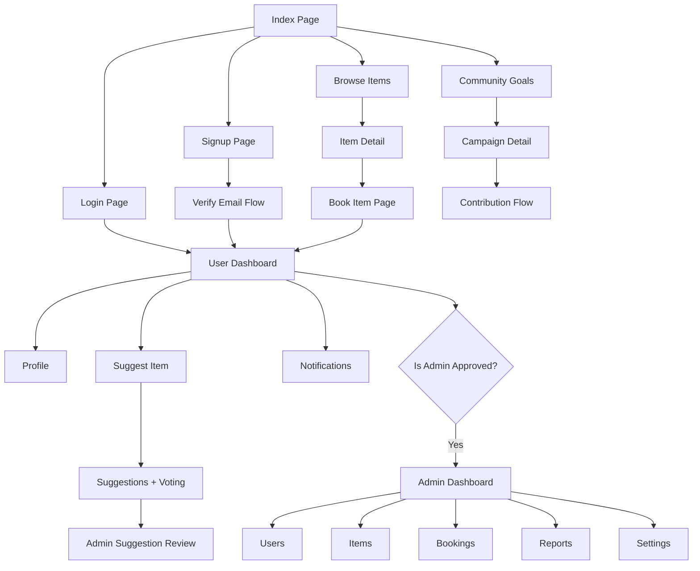
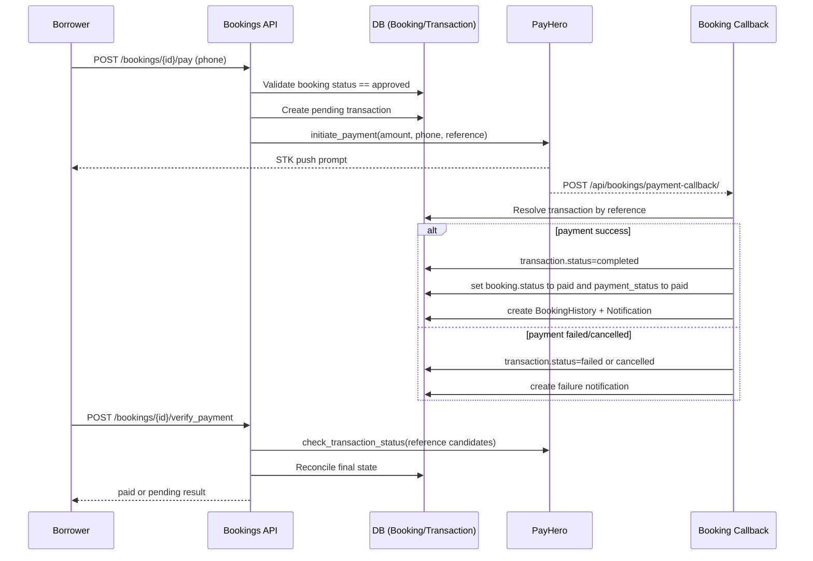
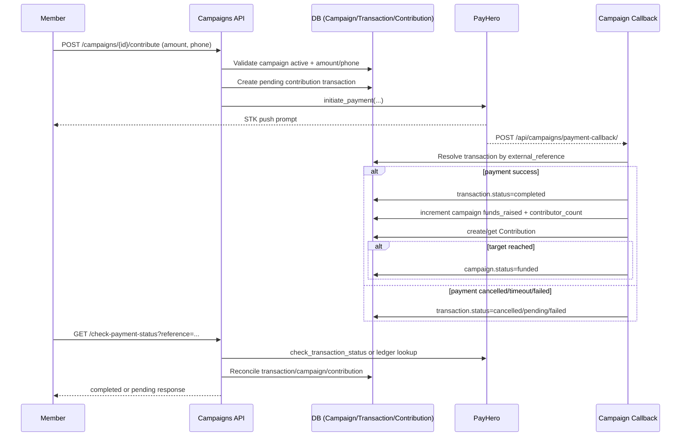

# Software Design Description (SDD, IEEE 1016-Aligned)

## 1. Document Control and Revision
- Project: Knot (Community Resource Sharing Platform)
- Document Type: Software Design Document
- Version: 1.0
- Date: 2026-04-12
- Authoring Basis: Static analysis of current workspace code

## 2. Introduction
### 2.1 Purpose
This document defines the software design of Knot, a Django-based platform for:
- User account management and identity verification
- Item catalog and borrowing workflows
- Community suggestions and crowdfunding campaigns
- Payment processing via PayHero (M-Pesa)
- Reviews, notifications, and admin operations

### 2.2 Scope
The SDD covers architecture, components, data model, interfaces, workflows, non-functional qualities, and deployment assumptions for the current implementation.

### 2.3 Definitions and Acronyms
- SDD: Software Design Description
- DRF: Django REST Framework
- JWT: JSON Web Token
- ERD: Entity Relationship Diagram
- DFD: Data Flow Diagram
- STK Push: SIM Toolkit payment prompt sent to a mobile device

## 3. System Overview
Knot enables communities to:
- Suggest needed items
- Convert approved suggestions into funding goals (campaigns)
- Contribute funds to campaigns
- Acquire and publish items for booking
- Borrow items with approval and payment flows

The system is a server-rendered Django web app with DRF JSON APIs and static frontend JavaScript.

## 4. Goals and Design Drivers
- Minimize operational complexity using a monolith architecture
- Keep business rules centralized in Django views/models/services
- Support both template-driven pages and API-driven frontend interactions
- Track status transitions for bookings and payments
- Provide admin moderation and operational control

## 5. Technology Stack
- Backend framework: Django 6.0.1
- API layer: Django REST Framework
- Auth tokens: SimpleJWT
- DB: SQLite (current environment)
- Media/static handling: Django static and media storage
- Payment integration: PayHero API (M-Pesa)
- Frontend: Django templates + static JS/CSS

## 6. System Context
### 6.1 External Actors
- Guest user
- Registered user (borrower/member)
- Admin/staff/approved admin
- Steward (item manager)
- PayHero payment service
- SMTP email provider (Gmail SMTP)

### 6.2 External Systems
- PayHero API endpoints
- SMTP server for account emails
- Browser clients for template UI and API calls

### 6.3 Current Role Assumption and Future Role Separation
- Current-state assumption: Admin and Steward responsibilities are currently fulfilled by the same operational person/team in this deployment.
- Design rationale: The data model and use cases intentionally keep Admin and Steward as separate roles to avoid future architectural rework.
- Planned evolution: Future releases will allow any qualified user (not only admins) to act as a Steward, subject to verification and policy checks.

## 7. High-Level Architecture
### 7.1 Architecture Style
- Modular monolith with domain apps:
  - accounts
  - items
  - bookings
  - campaigns
  - payments
  - reviews
  - core
  - messaging

### 7.2 Runtime Layers
1. Presentation layer
- Template routes in backend/views.py and app template views
- Static JavaScript under static/js

2. API layer
- DRF ViewSets and APIViews in each domain app

3. Domain layer
- Models, serializers, and services

4. Integration layer
- PayHero API client (campaigns/payhero.py)
- Email SMTP and verify-email package

5. Persistence layer
- Django ORM on SQLite

## 8. Component Design
### 8.1 Root Application
- settings.py configures apps, middleware, templates, static/media, auth model, email, PayHero values, and DRF JSON renderer
- urls.py composes template routes and API route includes

### 8.2 accounts App
Responsibilities:
- Registration, login, logout, JWT issuance
- Email verification and password reset token management
- Profile management
- Admin request workflows (request, approve, reject)
- Admin dashboard operations over users, items, bookings, reports, settings

Key classes/models:
- CustomUser
- EmailVerificationToken
- PasswordResetToken

Key implementation notes:
- Supports login by username or email
- Introduces approval-based admin access with ID-photo submission
- Large admin operations consolidated in accounts/views.py

### 8.3 items App
Responsibilities:
- Category management
- Item listings/details/availability
- Suggestion create/list/voting
- Suggestion approval to campaign publication

Key models:
- Category
- Item
- ItemImage
- ItemSuggestion

Key implementation notes:
- Auto recovers stale borrowed item statuses
- Suggestion approval can create or update campaign
- Voting restricted to suggestions that are no longer pending

### 8.4 bookings App
Responsibilities:
- Booking CRUD and lifecycle transitions
- Borrowing constraints and overlap checks
- Booking payment initiation and callback handling
- Booking history/audit trail
- Overdue synchronization and borrower blocking rules

Key models:
- Booking
- BookingHistory

Key services:
- sync_overdue_bookings_for_user
- get_unreturned_overdue_bookings_for_borrower

### 8.5 campaigns App
Responsibilities:
- Campaign discovery and statistics
- Contribution initiation and payment status polling
- Payment callback processing
- Fund pullout workflow and post-funding item creation

Key models:
- Organization
- Campaign

Integration points:
- PayHeroAPI class handles payment initiation/status and ledger lookup

### 8.6 payments App
Responsibilities:
- Transaction persistence
- Contribution linking
- Payout records

Key models:
- Transaction
- Contribution
- Payout

### 8.7 reviews App
Responsibilities:
- Create/list reviews for completed bookings
- Enforce reviewer role constraints
- Respond to reviews
- Expose user review statistics

Key model:
- Review

### 8.8 core App
Responsibilities:
- Site settings retrieval
- User notification CRUD + read-state operations

Key models:
- SiteSettings
- Notification

### 8.9 messaging App
Responsibilities:
- Conversation and message persistence
- Booking-linked chat flows (invoked through accounts views)

Key models:
- Conversation
- Message

## 9. Data Design
### 9.1 Primary Entities and Relationships
- CustomUser
  - One-to-many with Booking as borrower
  - One-to-many with Booking as steward
  - One-to-many with Review as reviewer/reviewee
  - One-to-many with Transaction and Contribution
  - Many-to-many with ItemSuggestion (voters)

- Category
  - One-to-many with Item
  - One-to-many with Campaign
  - One-to-many with ItemSuggestion

- Item
  - Many-to-one with Category
  - Many-to-one with CustomUser (steward)
  - Many-to-one with Organization (optional)
  - One-to-one with Campaign (optional acquired_item side)
  - One-to-many with ItemImage
  - One-to-many with Booking

- ItemSuggestion
  - Many-to-one with CustomUser (suggested_by)
  - Many-to-many with CustomUser (voters)
  - Optional one-to-many relation from Campaign side (campaign.suggested_item)

- Campaign
  - Many-to-one with Organization
  - Many-to-one with CustomUser (created_by)
  - Many-to-one with Category
  - Optional many-to-one with ItemSuggestion
  - One-to-many with Transaction and Contribution

- Booking
  - Many-to-one with Item
  - Many-to-one with CustomUser (borrower)
  - Many-to-one with CustomUser (steward)
  - One-to-many with BookingHistory
  - One-to-many with Review
  - One-to-many with Transaction

- Transaction
  - Optional many-to-one with Campaign
  - Optional many-to-one with Booking
  - Optional many-to-one with Organization
  - Optional one-to-one with Contribution

- Contribution
  - Many-to-one with CustomUser
  - Many-to-one with Campaign
  - One-to-one with Transaction

- Notification
  - Many-to-one with CustomUser

- Conversation
  - Many-to-many with CustomUser (participants)
  - Optional many-to-one with Item
  - Optional many-to-one with Booking

- Message
  - Many-to-one with Conversation
  - Many-to-one with CustomUser (sender)

### 9.2 Status Models
Booking.status:
- pending -> approved -> paid -> active -> completed
- pending -> declined
- pending/approved -> cancelled
- active -> overdue

Booking.payment_status:
- pending -> paid
- paid -> refunded
- pending -> failed

Campaign.status:
- draft -> active
- active -> funded
- funded -> completed (after pullout)
- active -> expired
- any -> cancelled (business/admin dependent)

ItemSuggestion.status:
- pending -> campaign_created
- pending -> approved/rejected (legacy/alternate statuses in model)

Transaction.status:
- pending -> processing/completed/failed/cancelled/refunded

## 10. ERD (Entity Relationship Diagram)


## 11. External Interface Design
### 11.1 Routing Overview
Root composition in backend/urls.py exposes:
- Public and authenticated template routes (index, browse, goals, suggest, dashboard)
- Account and admin routes via accounts app
- API namespaces:
  - /api/auth/
  - /api/items/
  - /api/bookings/
  - /api/campaigns/
  - /api/reviews/
  - /api/core/

### 11.2 REST API Contracts (Endpoint-Level)
The tables below define endpoint-level contracts from implemented routes and handlers.

#### 11.2.1 Accounts API (/api/auth/)
| Endpoint | Auth | Request | Success Response | Error / Notes |
|---|---|---|---|---|
| POST /api/auth/register/ | Public | JSON: username, email, password, password2, first_name, last_name, phone_number | 201 with created user payload | 400 validation errors |
| POST /api/auth/login/ | Public | JSON: username (or email), password | 200 with JWT refresh/access + user payload | 401/400 invalid credentials |
| POST /api/auth/logout/ | Authenticated | JSON: refresh token | 200 logout confirmation | 400 invalid token |
| POST /api/auth/token/refresh/ | Public with refresh token | JSON: refresh | 200 new access token | 401/400 token invalid/expired |
| GET /api/auth/profile/api/ | Authenticated | None | 200 user profile | 401 unauthorized |
| PUT/PATCH /api/auth/profile/api/update/ | Authenticated | JSON profile fields | 200 updated profile | 400 validation errors |
| GET /api/auth/verify-email/api/{token}/ | Public | Path token | 200 verification result | 400/404 invalid or expired token |
| POST /api/auth/resend-verification/api/ | Authenticated or template flow | JSON or form | 200 resend confirmation | 400 already verified or invalid state |
| POST /api/auth/password-reset/ | Public | JSON: email | 200 request accepted | 400 invalid email |
| POST /api/auth/password-reset/{token}/ | Public | JSON: password, confirm password | 200 password reset complete | 400 invalid token or validation failure |

#### 11.2.2 Items API (/api/items/)
| Endpoint | Auth | Request | Success Response | Error / Notes |
|---|---|---|---|---|
| GET /api/items/items/ | Public | Query: search, category, sort | 200 {count, results[]} | Results include image/review aggregates |
| GET /api/items/items/{slug}/ | Public | Path slug | 200 item detail | 404 if missing |
| GET /api/items/items/{id}/availability/ | Public | Query: start_date, end_date | 200 availability object | 400 invalid date format |
| GET /api/items/categories/ | Public | None | 200 category list | None |
| GET /api/items/stats/ | Public | None | 200 totals and most_borrowed | None |
| GET /api/items/suggestions/ | Public | Query: status (optional) | 200 {count, results[]} | By default excludes rejected |
| POST /api/items/suggestions/ | Authenticated | Multipart/JSON: name, description, estimated_cost, category or category_name, image | 201 suggestion | 401 auth required; 400 validation |
| POST /api/items/suggestions/{id}/vote/ | Authenticated | None | 200 vote toggled result | 403 if suggestion not open for voting |
| POST /api/items/suggestions/{id}/approve/ | Admin-authenticated | Editable suggestion/campaign fields | 200 campaign publication result | 403 admin required |
| POST /api/items/suggestions/{id}/delete/ | Admin-authenticated | None | 200 deletion confirmation | 403 admin required |

#### 11.2.3 Bookings API (/api/bookings/)
| Endpoint | Auth | Request | Success Response | Error / Notes |
|---|---|---|---|---|
| GET /api/bookings/bookings/ | Authenticated | Query: status, role | 200 list | Auto-syncs overdue states for user scope |
| POST /api/bookings/bookings/ | Authenticated | Serializer-based booking payload | 201 booking | 400 overlap/date/validation errors |
| GET /api/bookings/bookings/{booking_id}/ | Authenticated participant | Path booking_id | 200 booking detail | 404/403 filtered by queryset scope |
| POST /api/bookings/create/ | Authenticated | Multipart/JSON: item_id, start_date, end_date, purpose, borrower_id_photo | 201 {message, booking_id, status} | 400 overdue block, overlap, missing fields |
| POST /api/bookings/bookings/{booking_id}/approve/ | Steward | JSON: pickup_date, pickup_time, pickup_location, notes | 200 status | 403 non-steward; 400 invalid state |
| POST /api/bookings/bookings/{booking_id}/decline/ | Steward | JSON: notes | 200 status | 403 non-steward; 400 invalid state |
| POST /api/bookings/bookings/{booking_id}/cancel/ | Borrower or steward | JSON: notes | 200 status | 403/400 invalid transition |
| POST /api/bookings/bookings/{booking_id}/pay/ | Borrower | JSON: phone_number (optional if stored) | 200 payment_pending + references | 400 payment initiation errors |
| POST /api/bookings/bookings/{booking_id}/verify_payment/ | Borrower | None | 200 paid/pending state | Reconciles provider status and updates booking |
| POST /api/bookings/bookings/{booking_id}/checkout/ | Steward | None | 200 checked out | Requires booking status paid |
| POST /api/bookings/bookings/{booking_id}/checkin/ | Steward | None | 200 returned | Requires booking status active |
| GET /api/bookings/bookings/{booking_id}/history/ | Authenticated participant | None | 200 history list | None |
| POST /api/bookings/payment-callback/ | PayHero callback | JSON callback payload | 200 {status: ok} | 400/404 on missing reference/transaction |

#### 11.2.4 Campaigns API (/api/campaigns/)
| Endpoint | Auth | Request | Success Response | Error / Notes |
|---|---|---|---|---|
| GET /api/campaigns/campaigns/ | Public | Query: status, search, sort | 200 {results[]} | Includes progress and days remaining |
| GET /api/campaigns/campaigns/statistics/ | Public | None | 200 aggregate stats | None |
| GET /api/campaigns/campaigns/recent/ | Public | None | 200 recent contributions | Excludes anonymous |
| GET /api/campaigns/campaigns/{id}/contributors/ | Public | Path id | 200 contributor list | 404 if campaign missing |
| POST /api/campaigns/campaigns/{id}/contribute/ | Authenticated | JSON: amount, phone_number | 200 pending STK response | 400 validation or payment initiation failure |
| POST /api/campaigns/campaigns/{id}/pullout/ | Admin-authenticated | None | 200 pullout + optional auto-item creation | 403 admin required; 400 invalid campaign state |
| POST /api/campaigns/verify-payment/ | Authenticated | JSON: transaction_id | 200 completed/pending status | 404 transaction not found |
| GET /api/campaigns/check-payment-status/?reference=... | Authenticated | Query: reference (external_reference) | 200 completed/failed/pending | Also performs reconciliation and updates records |
| GET /api/campaigns/campaigns/{id}/detail/ | Public | Path id | 200 campaign detail | 404 missing |
| GET /api/campaigns/contributions/my/ | Authenticated | None | 200 mixed completed + pending/failed rows | Merges Contribution and Transaction views |
| POST /api/campaigns/payment-callback/ | PayHero callback | JSON callback payload | 200 {status: ok} | Handles success/cancel/timeout/failure branches |

#### 11.2.5 Reviews API (/api/reviews/)
| Endpoint | Auth | Request | Success Response | Error / Notes |
|---|---|---|---|---|
| GET /api/reviews/reviews/ | Public | Query: user, booking | 200 review list | Ordered by newest |
| POST /api/reviews/reviews/ | Authenticated | JSON: booking, review_type, rating, comment, optional sub-ratings | 201 created review | 400 if booking not completed or duplicate review |
| GET /api/reviews/reviews/{id}/ | Public | Path id | 200 review | 404 if missing |
| PUT/PATCH/DELETE /api/reviews/reviews/{id}/ | Authenticated | Review body (for update) | 200/204 | Permission guarded by DRF defaults and queryset |
| POST /api/reviews/reviews/{id}/respond/ | Authenticated reviewee | JSON: response | 200 response added | 403 non-reviewee |
| GET /api/reviews/stats/{user_id}/ | Public | Path user_id | 200 total, avg, rating distribution | None |

#### 11.2.6 Core API (/api/core/)
| Endpoint | Auth | Request | Success Response | Error / Notes |
|---|---|---|---|---|
| GET /api/core/site-settings/ | Public | None | 200 site settings | Creates default SiteSettings if absent |
| GET /api/core/notifications/ | Authenticated | None | 200 user notifications | User-scoped queryset |
| POST /api/core/notifications/mark_read/ | Authenticated | JSON: all=true or notification_ids[] | 200 status message | No-op if empty payload |
| GET /api/core/notifications/unread_count/ | Authenticated | None | 200 {unread_count} | None |

### 11.3 Template Interface Pages
Core pages:
- /
- /browse/
- /goals/
- /suggest/
- /dashboard/
- /campaigns/{id}/
- /items/detail/{slug}/
- /items/{slug}/book/

Account pages:
- /login/
- /signup/
- /accounts/profile/
- email verification and reset pages

Admin pages (custom admin UI):
- /admin-dashboard/
- /accounts/dashboard/
- /accounts/users/
- /accounts/items/
- /accounts/bookings/
- /accounts/suggestions/
- /accounts/reports/
- /accounts/settings/

## 12. Use Case Model
### 12.1 Primary Use Cases
1. Register and verify account
2. Browse and inspect items
3. Request item booking with ID photo
4. Approve booking and set pickup details
5. Borrower pays booking fee via M-Pesa
6. Checkout and return item
7. Submit and vote on item suggestions
8. Approve suggestion and publish campaign
9. Contribute to campaign and verify payment
10. Pull out funded campaign and auto-create item
11. Leave reciprocal reviews after completion
12. View and manage notifications
13. Admin manage users/items/bookings/reports/settings

### 12.2 Use Case Diagram


## 13. Data Flow Design
### 13.1 Level 0 DFD


### 13.2 Level 1 DFD: Booking Payment Flow


## 14. Interface and Navigation Design
### 14.1 Interface Principles in Current Implementation
- Server-side rendered pages for main user journeys
- API-backed dynamic behavior from static JavaScript
- Distinct custom admin UI separate from Django admin site

### 14.2 Interface Diagram (Page/Module Navigation)


## 15. Detailed Workflow Specifications
### 15.1 Booking Request Workflow
1. User submits item_id, start_date, end_date, purpose, borrower_id_photo.
2. System checks borrower overdue constraints.
3. System validates date format, date ordering, non-past dates.
4. System verifies item availability and overlap with blocking statuses.
5. System creates Booking with status pending.

### 15.2 Booking Approval and Fulfillment Workflow
1. Steward/admin reviews pending booking.
2. Approve path:
- status set to approved
- pickup metadata set
- history entry written
3. Decline path:
- status set to declined
- reason/notes persisted

### 15.3 Booking Payment Workflow
1. Borrower triggers pay action for approved booking.
2. System computes total fee if missing.
3. System creates pending Transaction linked to booking.
4. System invokes PayHero initiate payment.
5. Callback or manual verification updates:
- Transaction status
- Booking payment_status and booking status paid
- notification and history entries

### 15.4 Campaign Contribution Workflow
1. Authenticated user submits amount + phone.
2. Validation: active campaign, minimum amount, phone format.
3. System creates pending Transaction for contribution.
4. STK push initiated through PayHero.
5. Callback/status polling reconciles transaction.
6. On completion: increment campaign funds_raised and contributor_count, create Contribution.
7. If target reached: campaign status moved to funded.

### 15.5 Suggestion to Campaign Workflow
1. User creates suggestion.
2. Admin approves suggestion via SuggestionApproveView.
3. System creates or updates Campaign (active).
4. Suggestion status set to campaign_created.
5. Notifications sent to suggester and voters.

### 15.6 Fund Pullout and Item Creation Workflow
1. Admin posts pullout on funded/completed campaign.
2. System marks funds_pulled_out and timestamps.
3. If status funded, set completed.
4. If no item linked yet and suggested_item exists, auto-create Item with host organization and defaults.

### 15.7 Overdue Management Workflow
1. On relevant requests, service scans active bookings with end_date < today.
2. Status transitions active -> overdue.
3. BookingHistory overdue action logged.
4. Notification sent once per overdue booking to borrower.
5. Borrower with unreturned overdue bookings is blocked from creating new bookings.

### 15.8 Sequence Diagrams
#### 15.8.1 Booking Payment Sequence


#### 15.8.2 Campaign Contribution Sequence


  ### 15.9 Additional Design Diagrams
  #### 15.9.1 Booking State Machine (Current System)
  ```mermaid
  stateDiagram-v2
    [*] --> pending : booking created
    pending --> approved : admin/steward approves
    pending --> declined : admin/steward declines
    pending --> cancelled : borrower/admin cancels

    approved --> paid : borrower payment success
    approved --> cancelled : borrower/admin cancels

    paid --> active : admin/steward checkout
    active --> completed : admin/steward checkin
    active --> overdue : end date passed
    overdue --> completed : item returned

    declined --> [*]
    cancelled --> [*]
    completed --> [*]
  ```

  #### 15.9.2 Campaign State Machine (Current System)
  ```mermaid
  stateDiagram-v2
    [*] --> draft : campaign initialized
    draft --> active : published/approved

    active --> funded : funds_raised >= target
    active --> expired : end_date passed and target unmet
    active --> cancelled : admin cancels

    funded --> completed : pullout recorded
    funded --> cancelled : admin cancels

    expired --> [*]
    cancelled --> [*]
    completed --> [*]
  ```

  #### 15.9.3 C4 Container Diagram (Current System)
  ```mermaid
  flowchart TB
    Guest[Guest User]
    Member[Member/Borrower]
    AdminSteward[Admin/Steward]

    subgraph Client[Client Tier]
      Browser[Web Browser\nTemplates + Static JS/CSS]
    end

    subgraph App[Application Tier]
      Django[Django Monolith\naccounts/items/bookings/campaigns/payments/reviews/core/messaging]
    end

    subgraph Data[Data Tier]
      DB[(SQLite DB)]
      Media[(Media Files)]
    end

    PayHero[PayHero API]
    SMTP[SMTP Email Provider]

    Guest --> Browser
    Member --> Browser
    AdminSteward --> Browser

    Browser --> Django
    Django --> DB
    Django --> Media
    Django <--> PayHero
    Django --> SMTP
  ```

  #### 15.9.4 Deployment Diagram (Current Development Topology)
  ```mermaid
  flowchart LR
    subgraph UserDevice[User Device]
      WebClient[Browser]
    end

    subgraph AppHost[Application Host]
      DjangoProc[Django App Process]
      StaticMedia[Static + Media Directories]
      SQLiteFile[(db.sqlite3)]
    end

    subgraph Edge[External Endpoints]
      Ngrok[ngrok Public URL]
      PayHeroSvc[PayHero Service]
      EmailSvc[SMTP Service]
    end

    WebClient --> DjangoProc
    DjangoProc --> StaticMedia
    DjangoProc --> SQLiteFile
    DjangoProc --> Ngrok
    PayHeroSvc --> Ngrok
    DjangoProc --> EmailSvc
  ```

  #### 15.9.5 Role-Entity CRUD Matrix (Current System)
  | Entity | Guest | Member/Borrower | Admin/Steward |
  |---|---|---|---|
  | CustomUser/Profile | R (public profile limited) | R,U (own profile) | R,U,D (admin operations) |
  | Item | R (limited/public endpoints) | R | C,R,U,D |
  | ItemSuggestion | R | C,R,U (own intent), vote | R,U,D, approve/publish |
  | Campaign | R | R, contribute | C,R,U,D, pullout |
  | Booking | None | C,R,U(cancel own), pay | R,U(approve/decline/checkout/checkin/cancel) |
  | Transaction | None | R (own payment status) | R (operational oversight) |
  | Contribution | None | C,R (own) | R |
  | Review | R | C,R (eligible bookings) | C,R (as steward role), moderate via admin workflows |
  | Notification | None | R,U (own read state) | R,U (own read state; can trigger system notifications) |
  | Conversation/Message | None | C,R,U (authorized booking chat) | C,R,U (authorized booking chat) |

  Notes:
  - Current operations combine Admin and Steward responsibilities under one operator role.
  - CRUD capabilities above reflect implemented behavior and operational policy, not only raw model permissions.

### 15.10 Assumptions and Constraints (Current System)
Assumptions:
- Admin and Steward duties are currently fulfilled by one operational role in production use.
- Most member journeys are template-driven, with selective API calls from frontend JavaScript.
- Payment confirmation depends on asynchronous callbacks and/or polling reconciliation.
- Core data persistence is SQLite for current environment.

Constraints:
- SQLite limits concurrent write throughput and advanced HA options.
- Callback availability depends on public endpoint reachability (ngrok in current setup).
- External dependency behavior (PayHero, SMTP) affects end-to-end completion time.
- Some business operations are implemented in large consolidated view modules, increasing change risk.

### 15.11 Business Rules Catalog
BR-01 Booking Date Validity:
- Start/end dates cannot be in the past and end date cannot be earlier than start date.

BR-02 Booking Overlap Prevention:
- A booking cannot be created for an item if dates overlap with statuses in blocking set: pending, approved, paid, active, overdue.

BR-03 Overdue Borrower Blocking:
- Borrowers with overdue unreturned bookings cannot create new bookings.

BR-04 Booking Approval Authority:
- Only steward/admin role can approve or decline booking requests.

BR-05 Payment Before Checkout:
- Booking must be in paid status before checkout transition to active.

BR-06 Campaign Contribution Preconditions:
- Campaign must be active; contribution amount must be positive and satisfy minimum threshold.

BR-07 Campaign Funding Transition:
- When funds_raised >= target_amount, campaign transitions from active to funded.

BR-08 Pullout Completion Rule:
- Pullout can be recorded only for funded/completed campaigns; funded transitions to completed on pullout.

BR-09 Suggestion Publishing Rule:
- Admin approval can publish suggestion into an active campaign and notify interested users.

BR-10 Review Eligibility:
- Reviews can only be created for completed bookings by participants in the booking.

### 15.12 Permission and Access Model
Role definitions:
- Guest: unauthenticated visitor.
- Member/Borrower: authenticated user consuming platform services.
- Admin/Steward: current operational role managing moderation and booking operations.

Access rules by capability:
- Register/Login/Verification:
  - Guest can register/login and perform token-driven verification/reset flows.
- Browse and Detail:
  - Public endpoints expose limited listing/detail; full browsing flow requires authenticated verified user in template paths.
- Booking Create/Pay:
  - Member can create booking request and initiate payment for own approved booking.
- Booking Approve/Decline/Checkout/Checkin:
  - Admin/Steward only.
- Suggestion Create/Vote:
  - Member can create suggestion and vote (subject to status rules).
- Suggestion Approve/Delete and Campaign Pullout:
  - Admin/Steward only.
- Notifications:
  - Users read/mark only their own notifications.
- Reviews:
  - Booking participants only; response only by reviewee.

### 15.13 Error Handling and Recovery Strategy
Error response strategy:
- API endpoints return structured JSON errors with clear user-safe messages.
- Validation failures return 400-series responses and field-specific explanations where applicable.

Payment recovery strategy:
- Create transaction as pending before external initiation.
- Process callback idempotently using transaction reference resolution.
- Support manual/polling verification via provider status and local reconciliation.
- On reconciliation success, update transaction and dependent domain state (booking/campaign/contribution).

Operational failure handling:
- If callback is delayed/unavailable, polling endpoint remains source of truth for eventual consistency.
- If provider returns not found for one reference format, system attempts alternate references and ledger lookup.
- Failure states (failed/cancelled/timeout) are persisted and surfaced to user for retriable actions.

Observability guidance:
- Log reference IDs (booking_id, transaction_id, payhero_reference) for traceability.
- Emit warnings for mismatched callback payloads and unresolved references.

### 15.14 Operational Runbook (Current)
Daily checks:
- Verify payment callbacks are being received and processed.
- Monitor pending transactions aging beyond expected confirmation window.
- Review overdue bookings and notification generation.

Payment reconciliation procedure:
1. Locate transaction by user-facing reference.
2. Compare local status versus provider status endpoint.
3. If provider confirms success, reconcile local transaction and dependent booking/campaign records.
4. Create/verify contribution linkage for campaign payments.
5. Record outcome in audit/log channel.

Incident handling:
- Callback outage:
  - Keep system operational via polling verification.
  - Restore callback endpoint visibility and replay/reconcile pending transactions.
- Email delivery issues:
  - Verify SMTP connectivity/configuration and retry user notification actions.

Data correction guardrails:
- Prefer controlled admin actions and reconciliation endpoints over direct database edits.
- If manual correction is unavoidable, document change reason, affected IDs, and timestamp.

## 16. Security Design
### 16.1 Authentication and Authorization
- Session auth for template routes
- JWT support for API clients
- Permission checks in DRF views and admin-guarded template views
- Additional admin gating through is_admin_approved

### 16.2 Data Protection Considerations
- Sensitive identifiers and media uploads stored in media directories
- PayHero references and payment metadata persisted in transactions
- Current settings include hardcoded secrets/keys in configuration (must be externalized)

### 16.3 Input Validation
- Booking and profile image validation (extension and size checks)
- Campaign contribution amount and phone format checks
- Date validations for booking and availability

## 17. Non-Functional Requirements
### 17.1 Performance
- DB indexes present on key status and lookup fields
- Query optimizations with select_related/prefetch in key views
- Potential hotspots: large monolithic admin views and iterative loops in some endpoints

### 17.2 Reliability
- Idempotent-ish callback handling using transaction lookup and get_or_create for contributions
- Retry logic in payment initiation
- Multiple-reference verification for payment reconciliation

### 17.3 Maintainability
- Domain app separation is good
- Very large accounts/views.py introduces maintainability risk; candidates for service extraction

### 17.4 Scalability
- Current SQLite suitable for development/small deployment
- Horizontal scale and high-write payment throughput would require PostgreSQL + worker queue patterns

## 18. Deployment and Environment Design
### 18.1 Current Deployment Assumptions
- Django app with DEBUG currently enabled
- ngrok used for callback URLs in development
- Static/media served by Django in DEBUG

### 18.2 Production Design Recommendations
- Move secrets to environment variables
- Disable DEBUG and enforce secure cookie/CSRF settings
- Use PostgreSQL
- Add object storage for media
- Add task queue for email and payment reconciliation jobs
- Add observability: structured logs, metrics, trace IDs for callbacks

## 19. Testing Design
### 19.1 Existing Test Artifacts
Workspace includes targeted tests such as:
- test_dashboard.py
- backend/test_bookings_view.py
- backend/test_notification_api.py
- backend/test_image_fix.py

### 19.2 Recommended Coverage Expansion
- End-to-end tests for booking payment lifecycle
- Callback idempotency tests for campaign and booking payment handlers
- Permission matrix tests for admin and steward actions
- Contract tests for key API payloads
- Regression tests for overdue blocking and stale status sync

## 20. Risks and Known Design Gaps
1. Secrets in settings file: security and compliance risk.
2. Duplicate or overlapping route definitions in campaign URLs may increase ambiguity.
3. Very large view modules reduce readability and increase regression probability.
4. SQLite limits concurrency and transactional robustness for production workloads.
5. Some model/view status vocabularies are broader than strict workflows; governance required to avoid invalid transitions.

## 21. Traceability Matrix (Feature to Module)
- Authentication and profile: accounts
- Item inventory and browse: items
- Booking lifecycle: bookings + items + core notifications
- Campaign funding: campaigns + payments
- Reviews and reputation: reviews + accounts
- Site settings and notifications: core
- Messaging/chat: messaging + accounts booking chat handlers

## 22. Appendix A: Key Source Map
- backend/settings.py
- backend/urls.py
- backend/views.py
- backend/apps/accounts/models.py
- backend/apps/accounts/views.py
- backend/apps/accounts/urls.py
- backend/apps/items/models.py
- backend/apps/items/views.py
- backend/apps/items/urls.py
- backend/apps/bookings/models.py
- backend/apps/bookings/views.py
- backend/apps/bookings/services.py
- backend/apps/bookings/urls.py
- backend/apps/campaigns/models.py
- backend/apps/campaigns/views.py
- backend/apps/campaigns/payhero.py
- backend/apps/campaigns/urls.py
- backend/apps/payments/models.py
- backend/apps/reviews/models.py
- backend/apps/reviews/views.py
- backend/apps/core/models.py
- backend/apps/core/views.py
- backend/apps/messaging/models.py

## 23. Appendix B: Suggested Next Architecture Evolutions
1. Split accounts/views.py into focused modules:
- auth_views
- admin_views
- profile_views
- booking_admin_views
2. Introduce domain service layer for status transitions and policy checks.
3. Introduce finite-state transition guards for booking and campaign status fields.
4. Move callback processing into asynchronous jobs with retry and dead-letter handling.
5. Create OpenAPI schema for API contracts and client generation.
6. Separate operational role assignment so approved non-admin users can be designated as Stewards for item custody and booking approvals.
